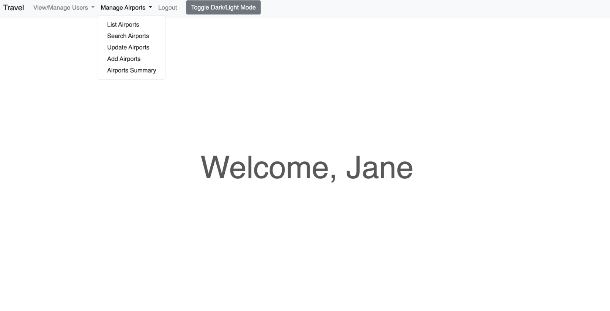
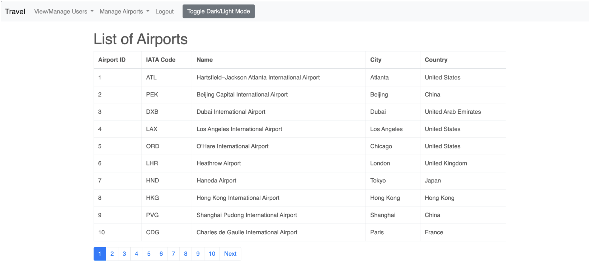

# Airline WebApp ✈️

### Duration: September 2024 to October 2024
This is a Flask-based web application for managing airline data. The web app connects to a PostgreSQL database, allowing users to manage airline information, user accounts, and analyze data efficiently. It includes features like login authentication, user management, and consolidated data views.

## 🎥 Demo

Here's a preview of the some features of the airline webapp:




## 📂 Project Structure

```plaintext
airline-webapp/
├── web_app.py                     
├── routes.py                      
├── database.py                    
├── requirements.txt               
├── config.ini                     
├── templates/                     
├── static/                        
└── README.md                      
```
## 🔧 Setup and Usage
### Prerequisites
1. Python: Version 3.8 or higher.
2. PostgreSQL: Ensure the database is installed and running.
3. Pip: Python package manager for installing dependencies.

### Clone the Repository

```bash
git clone https://github.com/yourusername/airline-webapp.git
cd airline-webapp
```

### Install Dependencies
Install required Python packages:

```bash
pip install -r requirements.txt
```

### Configure config.ini
Create a `config.ini` file in the root directory with the following structure:

```ini
[DATABASE]
host = your-database-host
user = your-database-username
password = your-database-password
port = your-database-port


[FLASK]
port = 5000  # Replace with your desired Flask port
```


### Set Up the Database
1. Ensure your PostgreSQL database is running.
2. Create necessary tables and populate initial data as per the schema defined in database.py.

### Run the Application
Start the web app using the following command:

```bash
python web_app.py
```

You should see the application running at:

Localhost: `http://127.0.0.1:<port> (default: 5000)`

Server: Adjust the URL and port based on your hosting configuration.

## 🔍 Features
### User Management:
Add, edit, and delete users.
Role-based access control with admin functionality.

### Authentication:
Secure login system using session management.

### Data Management:
Integration with a PostgreSQL database for handling user and airline-related data.
Consolidated views for advanced data insights.

### Interactive Frontend:
HTML templates dynamically rendered with Flask


## 🎯 Highlights
### Modular Design:
Organized structure separates routes, database operations, and configurations.

### Dynamic Data Views:
Fetch and display airline and user data dynamically using database queries.

### Scalability:
Easily extendable for additional features like reporting or analytics.


## 📚 Technologies Used
### Backend
1. Python: Primary language for building the application.
2. Flask: Lightweight web framework for handling routes and rendering templates.

### Database
1. PostgreSQL: Relational database for managing user and airline data.
2. pg8000: Python library for connecting to the PostgreSQL database.

### Frontend
1. HTML: Templating engine for dynamic rendering.

## ⚠️ Disclaimer
This project is for educational purposes and may require additional security measures for production use.
## 📬 Contact
Feel free to reach out for questions or collaboration:

Email: ashish.shiju@outlook.com

GitHub: [ashish-shiju](https://github.com/ashish-shiju)


